| 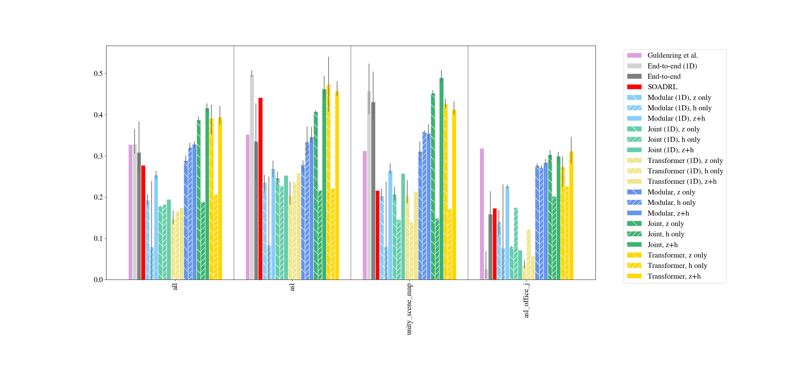 <br> **New 24/11/20: we compared the Guldenring et al. pretrained models (IROS 2020), see [here](wiki/testing_your_models_in_navrep.md).** |
| ------------------------ |

# NavRep


This is the official repository for the NavRep [paper](https://arxiv.org/pdf/2012.04406.pdf). it contains:
- a simulator aimed at allowing anyone to easy reproduce and improve on the state-of-the-art of RL for robot navigation.
- a suite for unsupervised-learning-assisted RL for robot navigation. It contains tools, datasets, models which allow you to easily reproduce findings from our paper.

### Publication

Daniel Dugas, Juan Nieto, Roland Siegwart and Jen Jen Chung, **NavRep: Unsupervised Representations for Reinforcement Learning of Robot Navigation in Dynamic Human Environments**, *Pending review, 2020* - [pdf](https://arxiv.org/pdf/2012.04406.pdf)

## Pre-requisites
Python 3.6

For example, on Ubuntu 20

```
sudo add-apt-repository ppa:deadsnakes/ppa
sudo apt-get update
sudo apt-get install -y python3.6 python3.6-dev
sudo apt-get install -y virtualenv python3-virtualenv
```

We recommend creating a virtualenv:

```
virtualenv ~/navrepvenv --python=python3.6
source ~/navrepvenv/bin/activate
```

rospy:

```
pip install --extra-index-url https://rospypi.github.io/simple/ rospy rosbag tf tf2_ros
```

## Install

Installing navrep is as simple as

```
pip install navrep
```

## Try it!

```
python -m navrep.envs.navreptrainenv
```

Press `w, a, s, d` to move around, `shift` to speed up the simulation.

## NavRepSim

### NavRep training environment


### NavRep testing environment

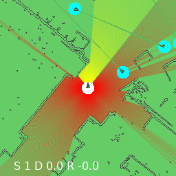
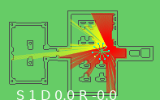
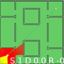

### SOADRL

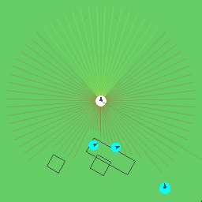

### CrowdMove

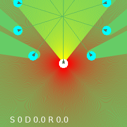

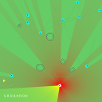
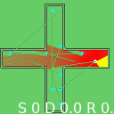
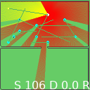
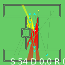
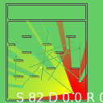

### Pfeiffer et al.

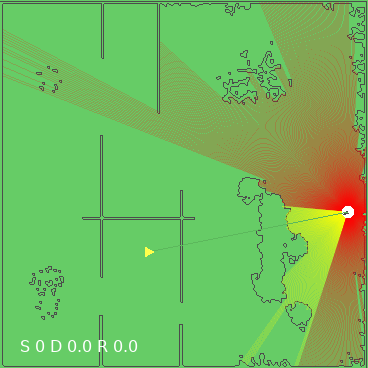
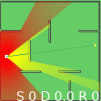


## Reproducing NavRep

The following is an example of how to reproduce the results in the NavRep paper.
It is a subset of the full procedure, which can be found in the [workflow_navrep.sh](navrep/scripts/workflow_navrep.sh) file.

### make a V dataset

```
python -m navrep.scripts.make_vae_dataset --environment navreptrain --render
```

(remove `--render` argument to speed up data generation)

### train V

```
python -m navrep.scripts.train_vae --environment navreptrain
```

### train M

```
python -m navrep.scripts.make_rnn_dataset --environment navreptrain
python -m navrep.scripts.train_rnn --environment navreptrain
```

### Play encoded environment

```
python -m navrep.scripts.play_navreptrainencodedenv --backend VAE_LSTM --encoding V_ONLY
```

### Play dream environment

### Train C

```
python -m navrep.scripts.train_gym_navreptrainencodedenv --backend VAE_LSTM --encoding V_ONLY
```

### Test C

```
python -m navrep.scripts.cross_test_navreptrain_in_ianenv --backend VAE_LSTM --encoding V_ONLY --render
```

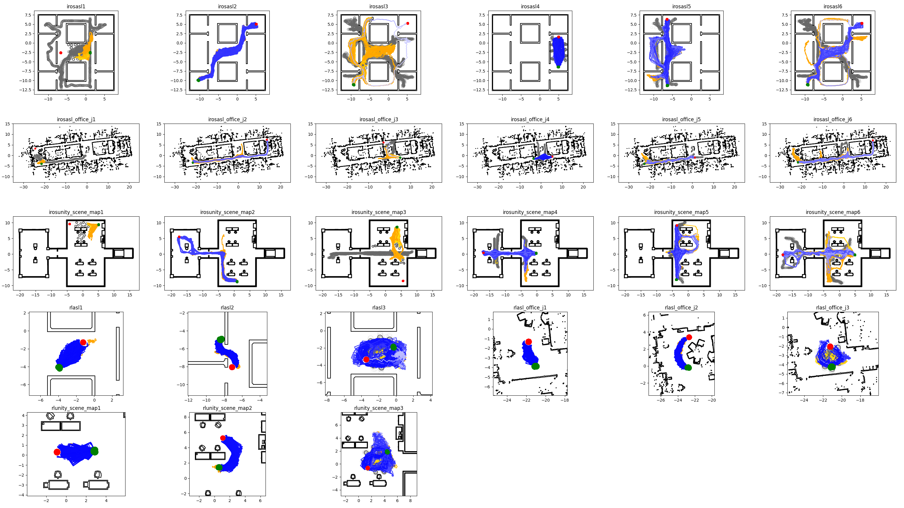

### Run in ROS node

```
roslaunch launch/sim_and_navrep.launch
```


## Using NavRep with your own models / environments

- [Testing your model in the NavRep test environment](wiki/testing_your_models_in_navrep.md)


## Pre-trained NavRep models

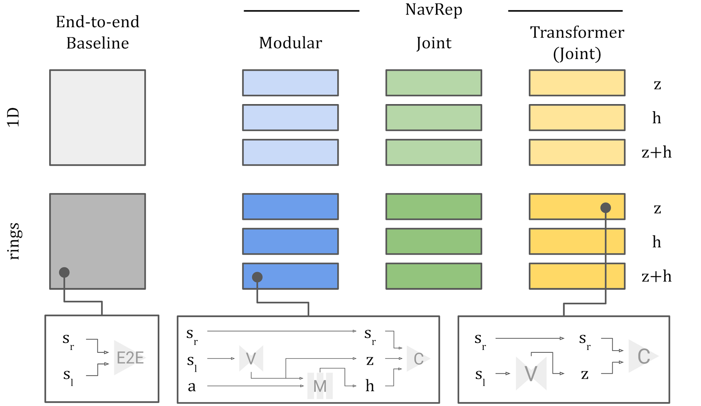

all models shown in the paper are available [here](models).

Copy the models from the V, M (modular archs) W (joint and transformer archs) and gym (C module) folders to your home directory according to the following structure:
```
~/navrep/
  └── models
      ├── gym
      ├── M
      └── V
```

run the following, and the models inside the ~/navrep directory will be tested in the navrep test environment:

```
python -m navrep.scripts.cross_test_navreptrain_in_ianenv --backend VAE_LSTM --encoding V_ONLY --render
```

flags:

```--backend```

- `VAE1D_LSTM` (Modular V, M with 1D lidar representation)
- `VAE_LSTM` (Modular V, M with rings lidar representation)
- `VAE1DLSTM` (Joint V+M with 1D lidar representation)
- `VAELSTM` (Joint V+M with rings lidar representation)
- `GPT1D` (Transformer with 1D lidar representation)
- `GPT` (Transformer with rings lidar representation)
- `E2E1D` (End-to-end with 1D lidar representation)
- `E2E` (End-to-end with rings lidar representation)

```--encoding```

- `V_ONLY` (a.k.a only z features)
- `M_ONLY` (a.k.a only h features)
- `VM` (a.k.a z+h features)
- `VCARCH` (for End-to-end only, specifies convolutional architecture)
- `CARCH` (for End-to-end only, specifies small architecture)

##  Tested NavRep training regimes

| **Environments**            | **Modular V, M**                  | **Joint V+M**                    | **Transformer V+M**              |
| --------------------------- | --------------------------------- | --------------------------------- | --------------------------------- |
| NavRep train                | :heavy_check_mark:                | :heavy_check_mark:                | :heavy_check_mark:                |
| NavRep test                 | :heavy_check_mark:                | :heavy_check_mark:                | :heavy_check_mark:                |
| SOADRL                      | :heavy_check_mark:                | :heavy_check_mark:                | :heavy_check_mark:                |
| Pfeiffer                    | :heavy_check_mark:                | :heavy_check_mark:                | :heavy_check_mark:                |
| CrowdMove                   | :heavy_minus_sign:                | :heavy_minus_sign:                | :heavy_minus_sign:                |


## Credits

This library was written primarily by Daniel Dugas. The transformer block codes, and vae/lstm code were taken or heavily derived from world models and karpathy's mingpt. We've retained the copyright headers for the relevant files.
